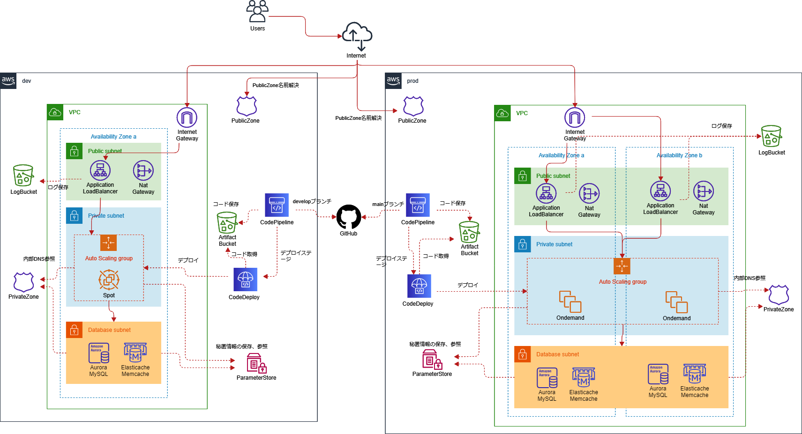

# wordpress on ec2

## 構成


### 全体
- devは冗長化なし
- prodは冗長化あり

### Route53
- PublicZone
  - 外部アクセス用。ALBを登録する
- PrivateZone
  - 内部用でdbのendpointをcnameで登録する

### VPC
- public-subnet
  - 直接Internetアクセス可能
- private-subnet
  - NatGateway経由でInternetアクセス可能
- database-subnet
  - Internetへのアクセスは不可
  - natもなし

### ALB
- public-subnetに配置
- SecurityGroupでアクセス制御
  - 443のみ許可
- Route53にAレコード登録する
- ACM利用

### EC2(AutoScalingGroup)
- private-subnetに配置
- IAMロールつける
  - SessionManager使える
  - S3へのread-only
- SecurityGroupでアクセス制御
  - ALBからの80のみ許可
- 外部アクセスはNatGateway経由
- SSHアクセスはなし。SSMセッションマネージャ経由で操作する。
- ParameterStoreにアプリケーションで利用する秘匿情報を格納する
- userdataで下記をインストール
  - php,nginx,codedeploy-agent,
  - その他、設定
  - packerとかでAMI作るのが理想ではある。

### RDS
- database-subnetに配置
- AuroraMySQL
- SecurityGroupでアクセス制御
  - EC2からの3306のみ許可
- 初期パスワードはランダム生成、SSM-ParameterStoreに格納
- 下記ログをCloudWatchに出力
  - "audit", "error", "general", "slowquery"

### Elasticache
- database-subnetに配置
- memcached
- SecurityGroupでアクセス制御
  - EC2からの11211のみ許可

### CodePipeline/CodeDeploy
- githubからコード取得、デプロイする


# 実行方法
```
terraform init -backend-config=dev/s3.tfbackend -reconfigure -upgrade
terraform plan -var-file=dev/terraform.tfvars
terraform apply -var-file=dev/terraform.tfvars
terraform destroy -var-file=dev/terraform.tfvars
```
