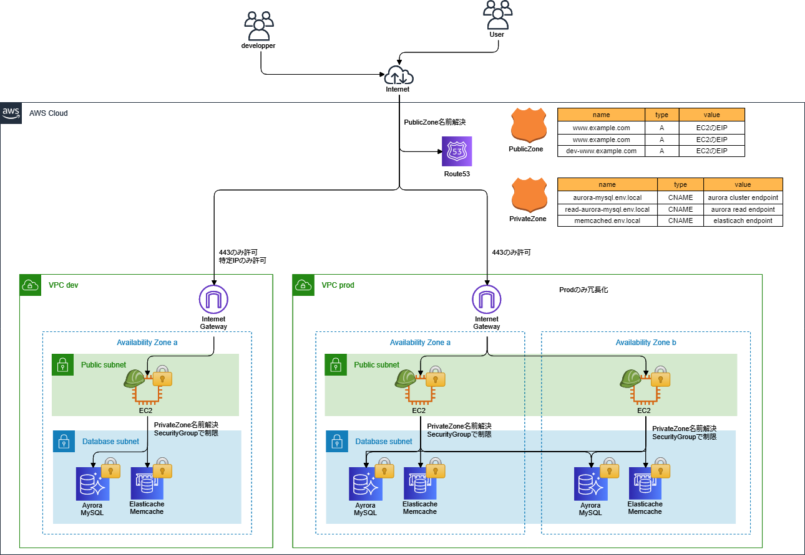

# simpleパターン

## 構成
- simple?

### 全体
- devは冗長化なし
- prodは冗長化あり

### Route53
- PublicZone
  - 外からアクセスするためのEC2のEIPを登録
- PrivateZone
  - 内部用でdbのendpointをcnameで登録する

### VPC
- 各環境ごとにVPC作成
- public-subnet
  - 直接Internetアクセス可能
- db-subnet
  - Internetへのアクセスは不可
  - natもなし

### EC2
- public-subnetに配置
- IAMロールつける
  - SessionManager使える
  - S3へのread-only
- SecurityGroupでアクセス制御
  - 外部からの443はオール許可
    - devは特定のipのみ許可
  - 外部へのアクセスはオールOK
- EIP付与する
- EIPをRoute53に登録
- userdataで下記をインストール
  - mariadbクライアント

### RDS
- private-subnetに配置
- AuroraMySQL
- SecurityGroupでアクセス制御
  - EC2からの3306のみ許可
  - 外部へのアクセスはオールOK
- 初期パスワードはランダム生成、SSM-ParameterStoreに格納
- 下記ログをCloudWatchに出力
  - "audit", "error", "general", "slowquery"

### Elasticache
- private-subnetに配置
- memcached
- SecurityGroupでアクセス制御
  - EC2からの11211のみ許可
  - 外部へのアクセスはオールOK
