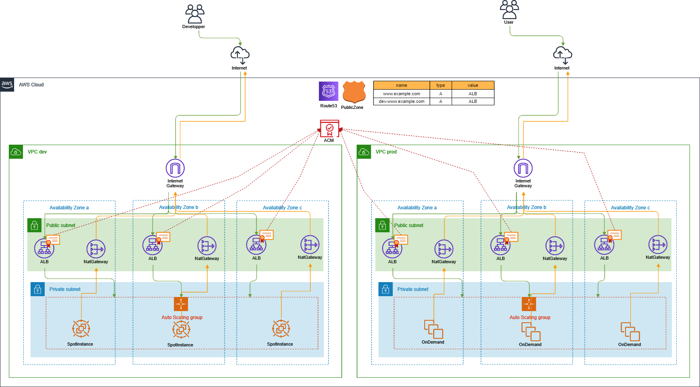

# EC2のAutoScaling

## 構成

### 全体
- devはspotinstance
- prodはondemand

### Route53
- PublicZone
  - 外からアクセスするためのALBを登録

### ACM
- dev用とprod用でACMで証明書作る

### VPC
- 各環境ごとにVPC作成
- public-subnet
  - 直接Internetアクセス可能
- private-subnet
  - Internetからの直接アクセス不可
  - nat-gateway経由でinternetアクセス可能
- nat-gateway
  - devは1つ
  - prodは各azごとに1つ

### ALB
- ACMで作成した証明書をアタッチ
- バックエンドのEC2にトラフィックを流す
- devは特定IPのみ許可
- prodは443全許可
- Route53に登録

### AutoScaling
- AMI
  - AmazonLinux2ベース
  - 必要なミドルウェアをセットアップしとく
  - Packer+Ansibleでイメージ作成
    - [ここら辺](https://github.com/megun/packer-samples/blob/master/amzn2.pkr.hcl)で作成する
- AutoScalingGroup
  - 上記のamiから起動
  - cpu使用率で自動スケールアウト・イン
  - devは時間で起動・停止

### EC2
- private-subnetに配置
- IAMロールつける
  - SessionManager使える
  - S3へのread-only
- SecurityGroupでアクセス制御
  - ALBからの80許可
  - 外部へのアクセスはオールOK
