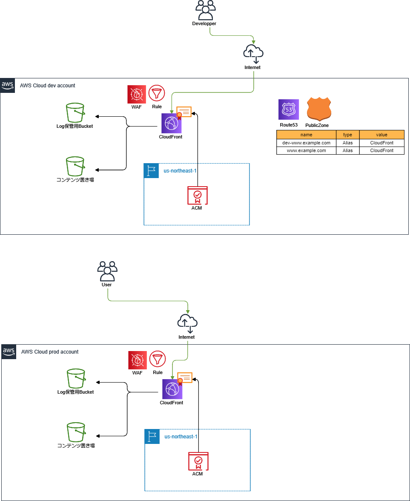

# CloudFrontとS3でWebサイト配信

## 構成

### 全体
- devとprodでaws-accountは分ける
- prodはassuem-roleでアクセスする

### Route53
- AliasでCloudFrontのレコード登録
- devとprodで同じドメイン使用する。
  - devアカウントのRoute53ゾーン使う
  - 本来はドメイン分けたほうがよさそうだが。。

### ACM
- dev用とprod用でACMでそれぞれ証明書作る
- CloudFrontに適用
- DNSでドメイン検証する

### CloudFront
- originはS3
- `nocache/～`はキャッシュしない
- ログはS3におく
- 独自ドメイン
  - ACMで作成した証明書を使う
- WAF使う
- S3オリジンのdamain名はregion付きで設定する（307リダイレクト対策）

### WAF
- CloudFront用
- dev環境
  - 特定IPのみ許可
  - terraform実行環境のIPも許可ルールに追加する
  - ManagedRule使う
- prod環境
  - ManagedRule使う

### S3
- Log保管用バケット用意
- CloudFrontからの参照用コンテンツ置き場用意
