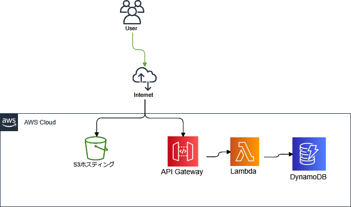
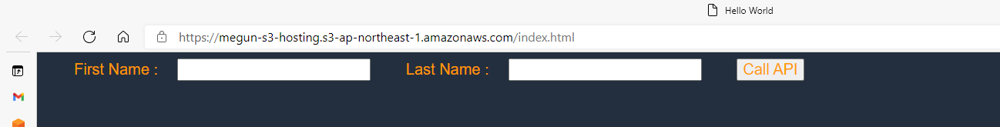
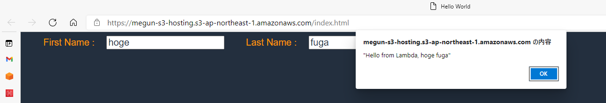

# S3+ApiGateway+LambdaでWebアプリケーション

- [このチュートリアル](https://aws.amazon.com/jp/getting-started/hands-on/build-web-app-s3-lambda-api-gateway-dynamodb/)の内容をterraformで作る。
  - AmplifyをS3ホスティングに変更してる
  - REST-APIをHTTP-APIに変更してる

# 構成図

# iam
- lambda用rolev
  - DynamoDBへの読み書きアクセス
  - CloudWatchLogsへの書き込み

# s3
- S3ホスティング
- 静的コンテンツ置き場
- 独自ドメインなし
- コンテンツアップロードもterraformでやる
  - 本来は別手段で行うのがいいとは思うが、一旦terraformでやる

# api-gateway
- PostされたデータをLambdaに流す
- Lambdaからのレスポンスを返す
- HTTP-APIで作成する

# lambda
- Postされたデータ受けてメッセージを返す
- DynamoDBに書き込みする
- 実行するLambda関数のデプロイもterraformでやる
  - 本来は別手段で行うのがいいとは思うが、一旦terraformでやる

# dynamodb
- 基本デフォルト設定
- テーブル名とハッシュキーのみ設定

# サンプルのアプリケーション
- テキストボックスに文字入力、`Call API` クリックすると、APIGateway->Lambda経由で処理が実行されて、レスポンスがポップアップで表示される。

- APIエンドポイントは、コードべた書きしてるので、API Gateway作成後に修正必要
