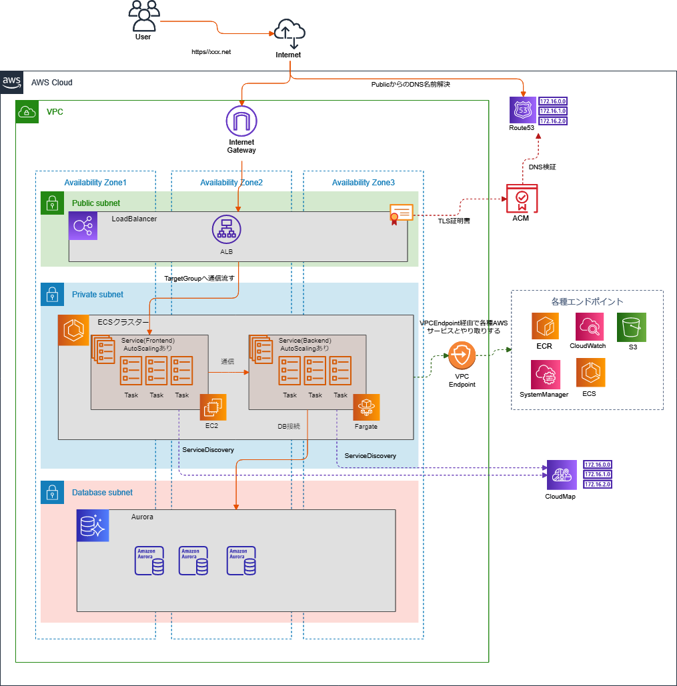

# ECSのサンプル

# 構成図


# VPC
- PublicSubnet
  - Internet接続あり
  - ALB用
- PrivateSubnet
  - Internet接続なし
  - ECS用
  - AWSサービスとの通信はVPCEndpoint経由
- PrivateSubnet
  - Internet接続なし
  - DB用
- NatGatewayは使用しない
- 3AZ

# VPCEndpoint
- PrivateSubnetにECS配置するため下記エンドポイント作成
  - SSM用エンドポイント
  - ECSエージェント用エンドポイント
  - ECR用エンドポイント
  - CloudWatchLogs用エンドポイント
  - S3用エンドポイント
- インターフェイスエンドポイントはSecurityGroup必要
  - VPCサブネットからの443は許可
- ゲートウェイエンドポイントはルーティングテーブル追加必要

# IAM
- ECS用EC2インスタンスロール
  - コンテナが稼働するEC2インスタンスにアタッチするロール
  - ECS用ポリシー（AmazonEC2ContainerServiceforEC2Role）、SSM用ポリシー（AmazonSSMManagedInstanceCore）あたりをつける
- ecs-executionロール
  - ECSエージェントにアタッチするロール
  - ECRからプルする権限、ClodwatchLogsに書き込む権限、ParameterStore/SecretManager参照権限など
- タスクロール
  - 各コンテナが利用するロール
  - コンテナからS3にアクセスする、DynamoDBにアクセスするとか
  - 今回は使ってない

# Route53
- Public用ゾーン
  - ALB登録
  - ACMのDNS検証用
- Private用ゾーン
  - RDS登録
- ServiceDiscovery用ゾーン
  - ECSのサービス登録

# ACM
- ALBにアタッチする
- DNS検証

# Cloudmap
- ECSのServiceDiscoveryに利用

# ALB
- 3AZに配置
- PublicSubnetに配置
- ACMアタッチする
- SecurityGroupでアクセス制限
  - 自分（terraform実行環境）のIPアドレスからの443だけ許可
- TargetGroup
  - TargetTypeはIP(ECSのネットワークモードをawsvpcにするため)
- Route53にAlias登録

# ECR
- [サンプル用のアプリケーション](https://github.com/megun/sample-apps/tree/master/sample1)をビルドしてプッシュする
  - 本来terraformでやるべきではないとは思うが。
- Lifecycleポリシー設定


# AutoScalingGroup
- ECS用EC2インスタンス用
- お金もったいないのでSpotインスタンス
- ENI制限あるのでt系ではなくc系インスタンス

# ECS
- Frontend
  - ALBからのリクエストを受ける用のサービス
  - EC2で起動
- Backend
  - Frontendからのリクエストを受ける用のサービス
  - Fargateで起動
- dockerイメージ
  - ECRから取得
  - VPCEndpoint経由で取得
- ネットワークモードはawsvpc
  - タスクにセキュリティグループ割り当ててアクセス制限かける
    - FrontendはALBからの80だけ許可
    - BackendはFrontendからの8080だけ許可
  - ENI制限引き上げが必要
    ```
    aws ecs list-attributes \
      --target-type container-instance \
      --attribute-name ecs.awsvpc-trunk-id \
      --cluster ecs-dev-cluster \
      --region ap-northeast-1

    aws ecs put-account-setting-default \
      --name awsvpcTrunking \
      --value enabled \
      --region ap-northeast-1
    ```
- ContainerInsights有効
- CapacityProvider
  - AutoScalingGroupと関連付けてECS用EC2インスタンスを自動スケーリング
  - スケールインが時間かかったり思ったように数が減らなくて微妙かも
- コンテナのAutoScaling
  - CPU平均使用率でスケール
- ECS用EC2インスタンスはセッションマネージャでログインできるようにする
- ServiceDiscovery
  - FrontendサービスとBackendサービス登録
  - FrontendとBackend間の通信で利用
- ログはCLoudwatchLogs
- DBパスワードなどはParameterStore使う
- terraformでtask定義管理
  - 差分発生するたびに古いrevisionが再作成されてrevision管理できない
  - ecs-cli,copilotなどでやるのがよさそうとは思う。

# RDS
- お金もったいないのでServerless
- ParameterStoreにパスワード保存
- Backendからの3306だけ許可

# 改善点
- ignore_changesがmoduleで使えず（いい方法が分からず）、AutoScalingGroupのdesired_capacityで差分が出てしまう。
- コンテナインスタンスを手動で削除しないとECSクラスタ削除ができない
- ライフサイクルフックで自動ドレイニングするようにしてない。
  - スポットインスタンスは自動ドレインがサポートされてるっぽいが。
